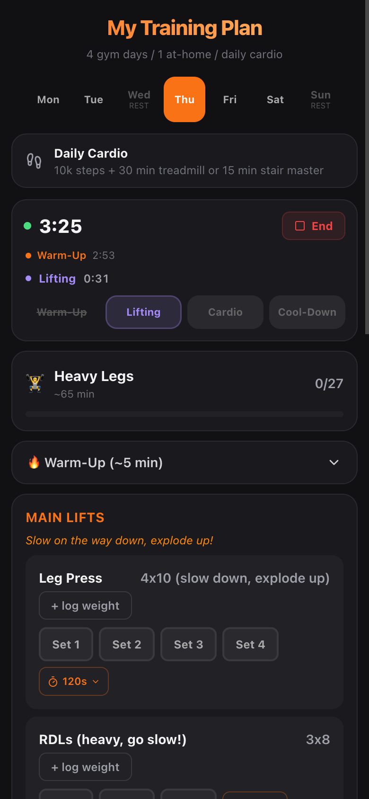

# Workout Tracker

A mobile-first PWA for tracking strength training workouts at the gym, with session timing, adjustable rest timers, weight logging, and adaptive warm-up/cool-down routines.



## Features

- **Session timer with lap tracking** -- timestamps each workout phase (warm-up, lifting, cardio, cool-down) like iPhone timer laps, with confirmation before switching phases
- **Adjustable rest timers** -- tap the rest time on any exercise to change it (15s, 30s, 45s, 60s, 90s, 120s), plus work timers for timed exercises like planks
- **Weight logging** -- log weight per exercise with last-session reference and personal record tracking
- **Weekly schedule** -- 5-day training split (4 gym + 1 at-home) with rest days, tap any day to preview
- **Exercise capture from social media** (planned) -- paste a TikTok/IG/YouTube URL and extract exercise details via Gemini AI
- **Adaptive warm-ups/cool-downs** (planned) -- warm-up and cool-down routines that match the day's muscle focus, with knee-safety flags

## Tech Stack

- Vite + React + TypeScript
- Tailwind CSS v4
- Supabase (auth + database)
- Dexie.js (IndexedDB for offline-first storage)
- vite-plugin-pwa (installable on iPhone)
- Vitest (testing)

## Setup

```bash
git clone https://github.com/YOUR_USERNAME/workout-tracker.git
cd workout-tracker
npm install
cp .env.example .env
# Fill in your Supabase URL and anon key in .env
npm run dev
```

## Configuration

Copy `.env.example` to `.env` and fill in:

- `VITE_SUPABASE_URL` -- your Supabase project URL
- `VITE_SUPABASE_ANON_KEY` -- your Supabase anon/public key
- `VITE_GEMINI_API_KEY` -- (optional, for Phase 5 video extraction)

## Install on iPhone

1. Deploy to your hosting provider
2. Open the URL in Safari
3. Tap Share > "Add to Home Screen"
4. Opens full-screen like a native app

## License

MIT
