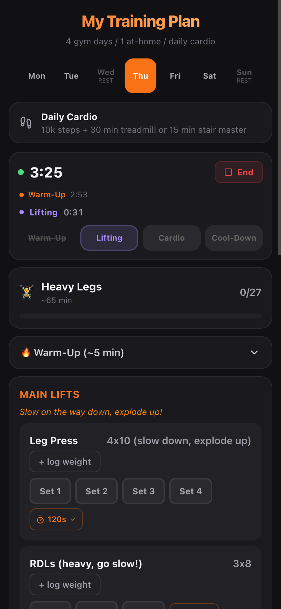

# Workout Tracker

A mobile-first PWA for tracking strength training workouts at the gym, with session timing, adjustable rest timers, weight logging, and adaptive warm-up/cool-down routines.



## Deploying & recovering from incidents

### Trigger a Replit redeploy
Git push does NOT auto-rebuild. To deploy a new bundle:
1. Push to `main`
2. Open the Replit workspace
3. Click the **Deploy** tab → **Republish** (or "Deploy" if first time)
4. Wait for the build to finish (~2 min)
5. Hard refresh https://workout-tracker-kanwia.replit.app/ to bypass PWA cache

### If sign-in is broken
The app runs in local-first mode — sign-in is for cross-device sync only. If you can't sign in:
1. The app should still work — your data lives in your browser via IndexedDB
2. To check whether Supabase is the problem, run: `curl -sS -o /dev/null -w "%{http_code}\n" https://<your-supabase-ref>.supabase.co/auth/v1/health`. Anything except 200 means the backend is down.
3. If Supabase is suspended (>7 days inactive), restore it in the Supabase dashboard.
4. If Supabase is fully gone (NXDOMAIN), you need to provision a new project. Run `supabase/migrations/*` against the new project and redeploy `supabase/functions/generate`.

### If onboarding seems to hang on the Confirm screen
Check browser devtools console. The local Dexie write may have failed (Safari private mode, OPFS quota, etc.). The app now surfaces this — if you see no error, it's something else; file an issue.

## Features

- **Session timer with lap tracking** -- timestamps each workout phase (warm-up, lifting, cardio, cool-down) like iPhone timer laps, with confirmation before switching phases
- **Adjustable rest timers** -- tap the rest time on any exercise to change it (15s, 30s, 45s, 60s, 90s, 120s), plus work timers for timed exercises like planks
- **Weight logging** -- log weight per exercise with last-session reference and personal record tracking
- **Weekly schedule** -- 5-day training split (4 gym + 1 at-home) with rest days, tap any day to preview
- **Exercise capture from screenshots** -- upload 1–3 screenshots of a workout (gym board, planner, social post) and Claude vision extracts the exercise names, sets, reps, and notes server-side via the `extract_exercises` edge-function op
- **Adaptive warm-ups/cool-downs** -- warm-up and cool-down routines that match the day's muscle focus, with knee-safety flags

## Tech Stack

- Vite + React + TypeScript
- Tailwind CSS v4
- Supabase (auth + database)
- Dexie.js (IndexedDB for offline-first storage)
- vite-plugin-pwa (installable on iPhone)
- Vitest (testing)

## Setup

```bash
git clone https://github.com/YOUR_USERNAME/workout-tracker.git
cd workout-tracker
npm install
cp .env.example .env
# Fill in your Supabase URL and anon key in .env
npm run dev
```

## Configuration

Copy `.env.example` to `.env` and fill in:

- `VITE_SUPABASE_URL` -- your Supabase project URL
- `VITE_SUPABASE_ANON_KEY` -- your Supabase anon/public key
- `VITE_GEMINI_API_KEY` -- **no longer required**. Exercise extraction was migrated off client-side Gemini on 2026-04-20 (the key was leaking into the production bundle); image-based extraction now runs through the `extract_exercises` op on the server. Delete the line from your `.env` if present.

### Server-side secrets (set in Supabase Dashboard -> Project Settings -> Functions)

- `ANTHROPIC_API_KEY` -- used by the `generate` edge function for plan
  generation, exercise swap, warmup/cooldown/cardio routines, AND image-based
  exercise extraction (all on Claude Opus 4.7). Replaced `GEMINI_API_KEY` on
  2026-04-20.

## Install on iPhone

1. Deploy to your hosting provider
2. Open the URL in Safari
3. Tap Share > "Add to Home Screen"
4. Opens full-screen like a native app

## License

MIT
